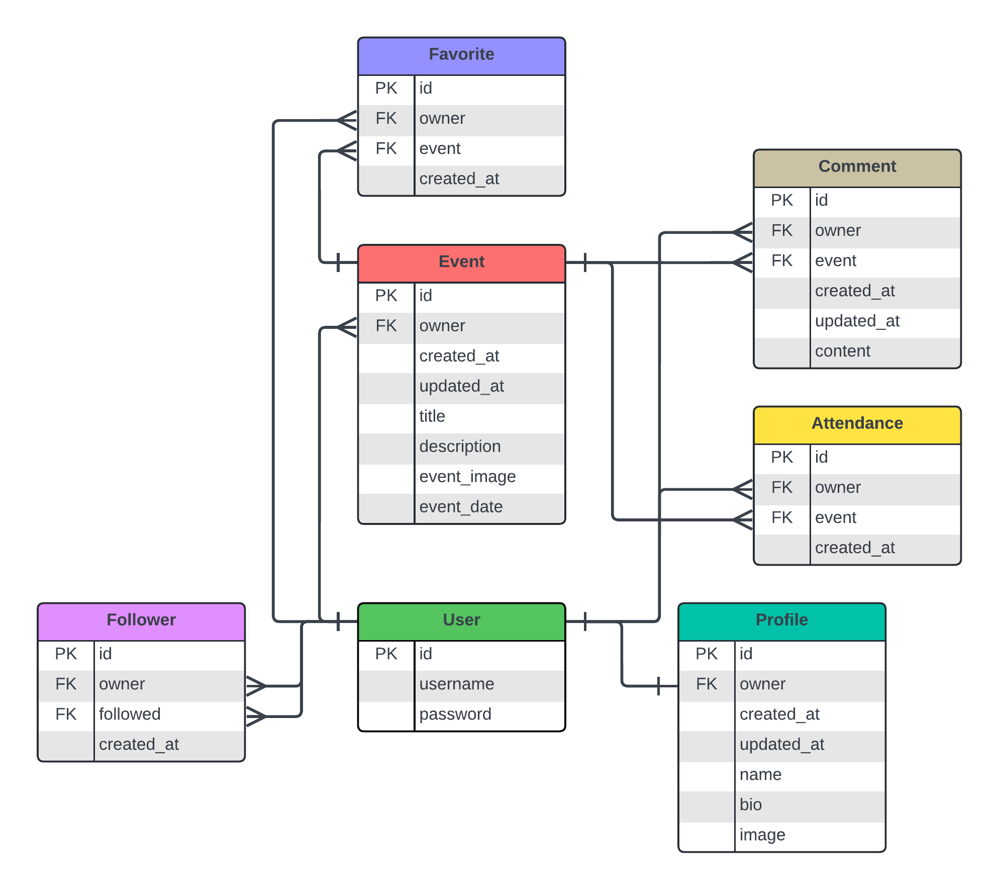
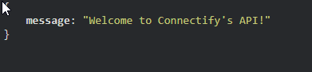
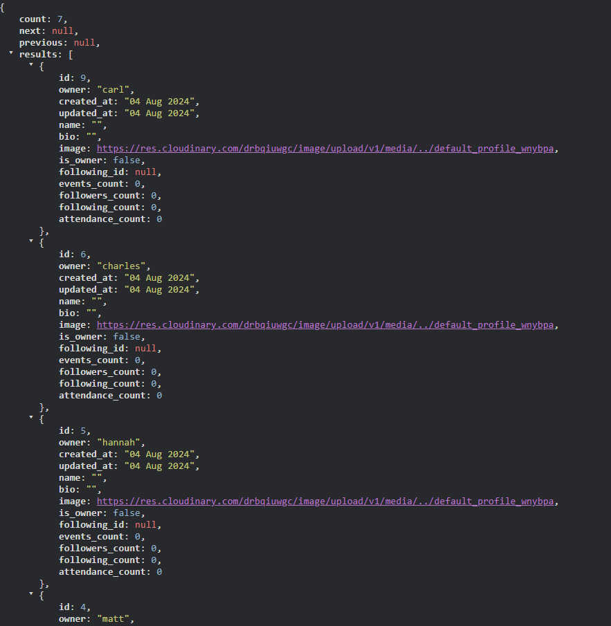
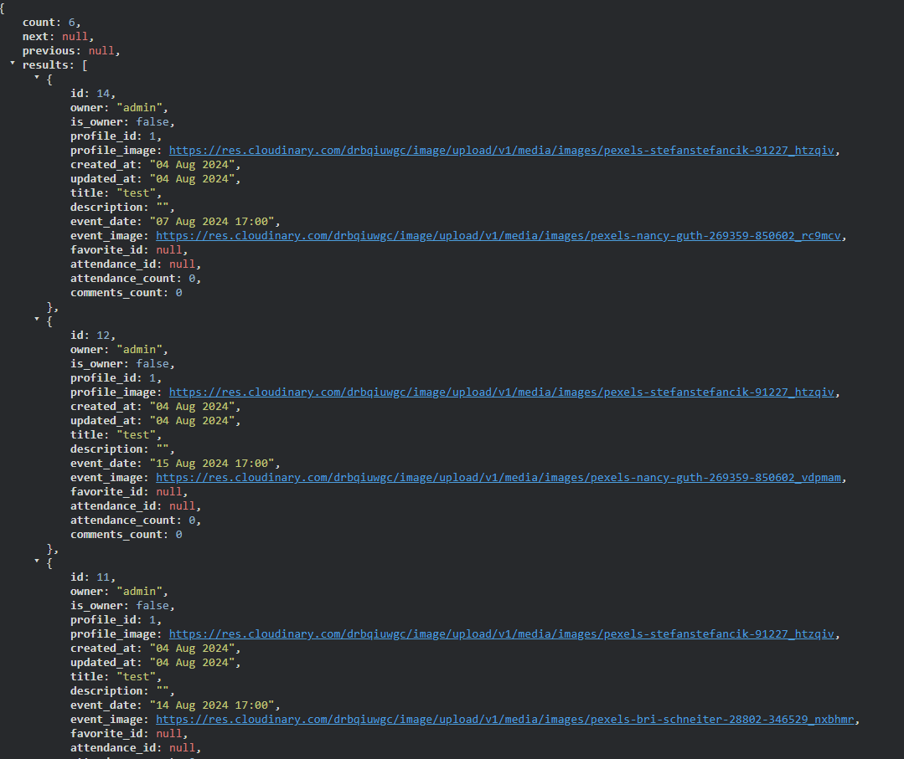
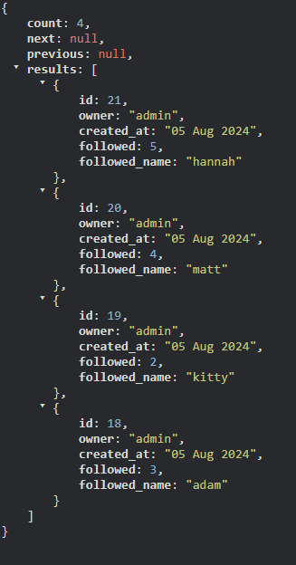
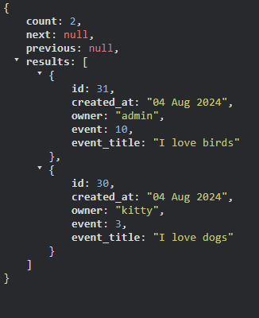
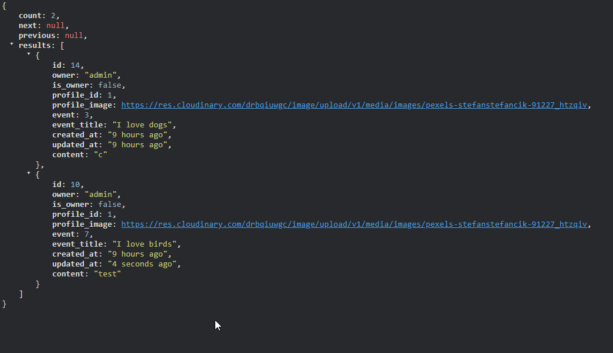
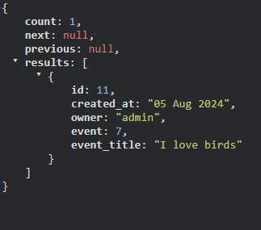

# connectify. API

Welcome! This project provides the backend services and API endpoints for the connectify. platform, developed as part of my advanced frontend specialization at Code Institute.

Visit the deployed API here → [API](https://connectify-api-da6695597009.herokuapp.com/) 
Visit the frontend repository here → [Frontend](https://github.com/enniovilla/project-5-frontend)

## Content

- [Project](#project)
  * [Objective](#objective)
- [Project Structure](#project-structure)
  * [Developer User Stories](#developer-user-stories)
- [Database Design](#database-design)
  * [Models](#models)
- [Features](#features)
  * [Home Page](#home-page)
  * [Profiles](#profiles)
  * [Events](#events)
  * [Followers](#followers)
  * [Attendances](#attendances)
  * [Comments](#comments)
  * [Favorites](#favorites)
- [Testing](#testing)
- [Deployment](#deployment)
- [Fork](#fork)
- [Clone](#clone)
- [Credits](#credits)

# Project

## Objective

With the launch of this platform, my goal is to simplify the process for individuals looking to connect with like-minded people and participate in local events. By joining through our website, users can effortlessly discover and sign up for activities that align with their interests. Additionally, the platform provides a comprehensive overview of all the events available, making it easy for users to find and engage in meaningful social experiences.

## Project Structure

Given the time limitations and the needs of the Project 5 assessments, the project's overall framework was adapted from the [DRF API](https://github.com/enniovilla/drf_api) walkthrough. This ensured that it included many of the walkthrough's core components.

Nevertheless, I developed custom models, including one for "attend," and made adjustments to the walkthrough models to better suit the unique requirements of my sharing platform.

## Developer User Stories

You can find the User Stories here: [GitHub Project](https://github.com/users/enniovilla/projects/9).

# Database Design

## Models

The relationships among these models are summarized in the following entity-relationship diagram.

[Back to top](<#content>)

# Features

The backend of the project consists of a page for profiles, events, followers, attendances, comments and favorites.

## Home Page

When entering the API for the first time, the user is greeted by a simple welcome message.

[Back to top](<#content>)

## Profiles

On the profiles page you can see a list of profiles and each profile contains the owner, created_at, updated_at, name, bio and image fields. The is_owner, following_id, events_count, followers_count, following_count and attendance_count fields have also been added to the serializer.

[Back to top](<#content>)

## Events

On the events page, you can see a list of events with the fields owner, created_at, updated_at, title, description, event_image and event_date. The serializer added the fields is_owner, profile_id, profile_image, favorite_id, attendance_id, attendance_count and comments_count.

[Back to top](<#content>)

## Followers

The followers template only contains three fields: owner, followed and created_at and through the serializer I've only added an extra followed_name field.

[Back to top](<#content>)

## Attendances

In attendances we have the owner, event, event_title and created_at fields.

[Back to top](<#content>)

## Comments

The comments model is quite simple and contains the owner, event, created_at, updated_at and content fields. Through the serializer I've added the is_owner, profile_id, profile_image and event_title fields.

[Back to top](<#content>)

## Favorites

And lastly we have favorites, which contain the owner, event, created_at and event_title fields. 

[Back to top](<#content>)

# Testing

Please click [here](TESTING.md) to go to the testing document.

[Back to top](<#content>)

# Technologies Used

## Languages

* [Python](https://en.wikipedia.org/wiki/Python_(programming_language)) - Provides the functionality for the DRF backend framework.

[Back to top](<#content>)

## Frameworks & Software

* [Django Rest Framework](https://www.django-rest-framework.org/)
* [PEP8 Validation](https://pep8ci.herokuapp.com/)
* [Github](https://github.com/)
* [Heroku](https://www.heroku.com/)
* [Cloudinary](https://cloudinary.com/)

[Back to top](<#content>)

## Libraries

* asgiref
* cloudinary
* dj-database-url
* dj-rest-auth
* Django
* django-allauth
* django-cloudinary-storage
* django-cors-headers
* django-filter
* django-rest-framework
* djangorestframework-simplejwt
* gunicorn
* oauthlib
* Pillow
* psycopg2
* PyJWT
* python3-openid
* pytz
* requests-oauhlib
* sqlparse

[Back to top](<#content>)

## Deployment

The application has been deployed from GitHub to Heroku by following the steps:

1. Create or log in to your account at [Heroku](https://www.heroku.com/).
2. Create a new app, add a unique app name and then choose your region.
3. Click on Create App.
4. Go to "Settings".
5. Under Config Vars add a key "PORT" and value "8000".
6. Add required buildpacks (further dependencies). For this project, set it up so Python will be on top and Node.js on bottom.
7. Go to "Deploy" and select "GitHub" in "Deployment method".
8. To connect Heroku app to your Github repository code enter your repository name, click "Search" and then "Search" when it shows below.
9. Choose the branch you want to build your app from.
10. If preferred, click on "Enable Automatic Deploys", which keeps the app up to date with your GitHub repository.
11. Wait for the app to build. Once ready you will see the “App was successfully deployed” message and a "View" button to take you to your deployed link.

[Back to top](<#contents>)

## Fork

1. Log in to GitHub.
2. Go to the repository for the project.
3. Click the Fork button in the top right corner.

[Back to top](<#content>)

## Clone

1. Log in to GitHub.
2. Go to the repository for the project.
3. Click on the **green code button** and select if you would like to clone with HTTPS, SSH or GitHub CLI and copy the link below.
4. Navigate to the directory where you want to clone the repository and open terminal.
5. Type *git clone* into the terminal and paste the link you have from number 3. Press enter. This command will download the entire repository to your local machine.

[Back to top](<#content>)

# Credits

* The default profile and default event images were provided by Code Institute in the Django Rest Framework walkthrough project and I reused them.
* The biggest part of my backend is based on CI's DRF API.

[Back to top](<#content>)